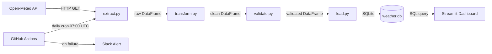

# ETL Pipeline CI/CD System


A fully automated, tested, and monitored data pipeline built as a portfolio project. Pulls live weather data for 5 cities daily, validates it, loads it into a database, and visualises it on a dashboard — all orchestrated via GitHub Actions with Slack alerting on failure.

---

## What this demonstrates

| Skill | Implementation |
|---|---|
| **Data engineering** | Modular ETL pipeline (extract → transform → validate → load) using pandas and SQLAlchemy |
| **CI/CD** | GitHub Actions workflows — lint + test on every push, full ETL on daily cron schedule |
| **Testing & data quality** | 20 pytest tests, 100% coverage on core logic, pandera schema validation |
| **Monitoring** | Streamlit dashboard with KPIs, charts, city comparison, and pipeline run history |
| **Alerting** | Slack webhook notifications on pipeline failure |

---

## Architecture


---

## Project structure
```
etl-pipeline/
├── src/
│   ├── extract.py        # Fetches weather data from Open-Meteo API
│   ├── transform.py      # Cleans data and adds derived columns
│   ├── validate.py       # Pandera schema validation
│   ├── load.py           # Persists to SQLite with upsert logic
│   └── pipeline.py       # Orchestrates all steps for 5 cities
├── tests/
│   ├── test_transform.py # 13 unit tests for transform logic
│   └── test_validate.py  # 7 tests for schema validation
├── dashboard/
│   └── app.py            # Streamlit dashboard
├── .github/workflows/
│   ├── ci.yml            # Lint + test on every push
│   └── pipeline.yml      # Daily ETL cron + Slack alert
└── requirements.txt
```

---

## Cities tracked

| City | Country | Coordinates |
|---|---|---|
| Dublin | Ireland | 53.33°N, 6.25°W |
| London | UK | 51.51°N, 0.13°W |
| New York | USA | 40.71°N, 74.01°W |
| Chennai | India | 13.08°N, 80.27°E |
| Kozhikode | India | 11.25°N, 75.78°E |

---

## Quick start

**1. Clone and set up environment**
```bash
git clone https://github.com/ughitsashwin/etl-pipeline.git
cd etl-pipeline
python -m venv .venv
source .venv/bin/activate
pip install -r requirements.txt
```

**2. Run the pipeline**
```bash
PYTHONPATH=. python src/pipeline.py
```

**3. Run the tests**
```bash
PYTHONPATH=. pytest tests/ -v --cov=src --cov-report=term-missing
```

**4. Launch the dashboard**
```bash
streamlit run dashboard/app.py
```
Open http://localhost:8501 in your browser.

---

## CI/CD workflows

| Workflow | Trigger | What it does |
|---|---|---|
| `ci.yml` | Every push to main | Runs ruff linter + full pytest suite |
| `pipeline.yml` | Daily at 07:00 UTC | Runs full ETL for all 5 cities, alerts Slack on failure |

---

## Tech stack

| Layer | Tool |
|---|---|
| Language | Python 3.13 |
| Data manipulation | pandas |
| HTTP requests | requests |
| Data validation | pandera |
| Database | SQLite + SQLAlchemy |
| Testing | pytest + pytest-cov |
| Linting | ruff |
| CI/CD | GitHub Actions |
| Dashboard | Streamlit |
| Alerting | Slack Incoming Webhooks |

---

## Data quality checks

The pandera schema enforces these rules on every pipeline run:

- `date` must be a valid datetime
- `city` must be one of the 5 configured cities
- `temp_max` and `temp_min` must be between -90°C and 60°C
- `precip_mm` must be between 0 and 500mm (no negative rainfall)
- `temp_range` must be ≥ 0 (max can never be less than min)
- `is_rainy` must be a boolean

If any rule is violated, the pipeline fails loudly and a Slack alert fires.

---

*Built with Python, GitHub Actions, and free tools only.*
